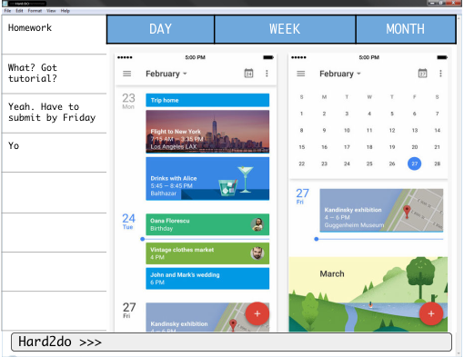

# Hard2Do 

 

* This is a desktop ToDoList application. It has a GUI but most of the user interactions happen using 
  a CLI (Command Line Interface).
* It is built as a project submission for module CS2103 which is offered in NUS in sem 1 16/17. 
* It is **written in OOP fashion** using JavaFx
  
#### Site Map
* [User Guide](docs/UserGuide.md) 
* [Developer Guide](docs/DeveloperGuide.md) 
* [Learning Outcomes](docs/LearningOutcomes.md) 
* [About Us](docs/AboutUs.md)
* [Contact Us](docs/ContactUs.md)

#### Acknowledgements

* Some parts of this sample application were inspired by the excellent 
  [Java FX tutorial](http://code.makery.ch/library/javafx-8-tutorial/) by *Marco Jakob*. 
* The most of the code is reused from 
  [Address-Book Level 4](https://github.com/se-edu/addressbook-level4)

#### Licence : [MIT](LICENSE)

