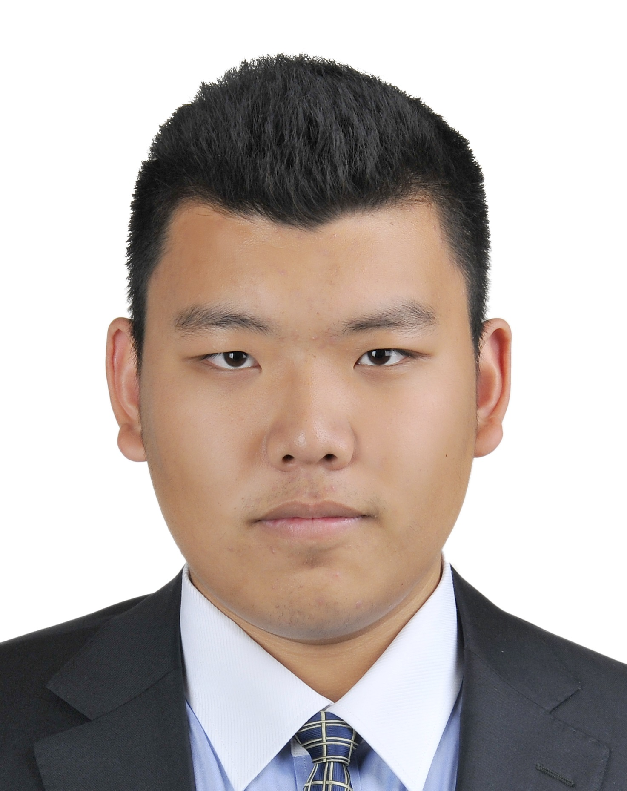
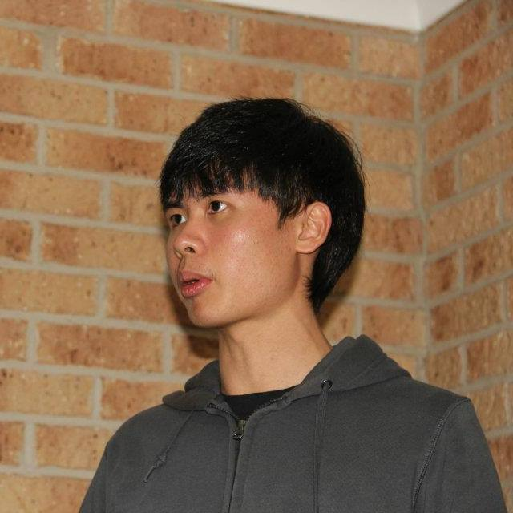
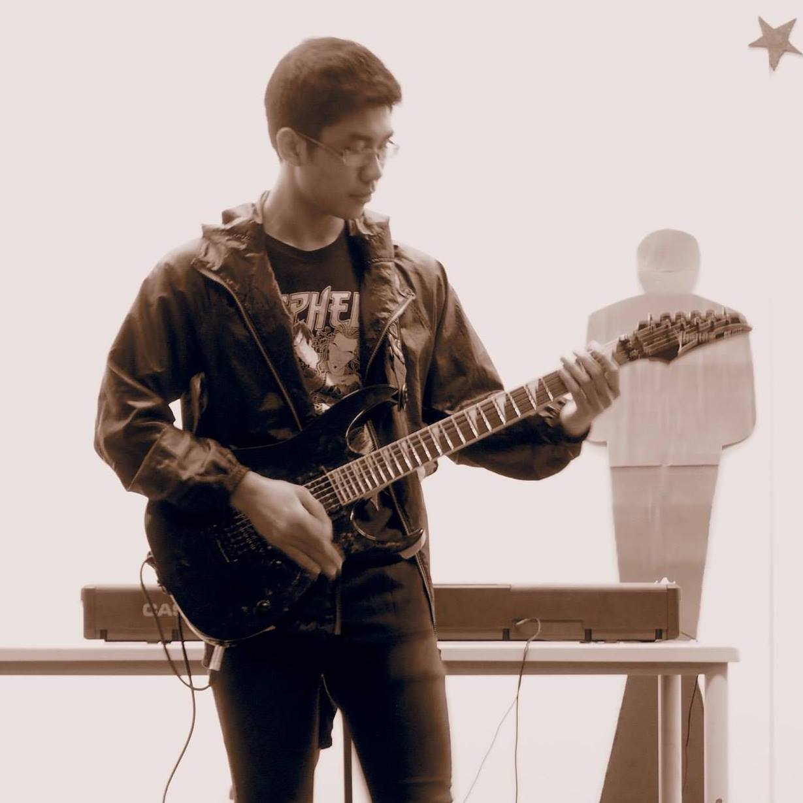

# About Us

We are a team based in the [School of Computing, National University of Singapore](http://www.comp.nus.edu.sg).

## Project Team

#### [Tianze](http://www.comp.nus.edu.sg/tankztz)  
 
Role: Developer  
Responsibilities: Testing  

-----

#### [Nicolas](http://github.com/nicolashww)
 
Role: Developer    
Responsibilities: Code Quality  

-----

#### [Wei Jie](http://github.com/skynobleu)
 
Role: Developer    
Responsibilities: Integration  

-----

#### [Quang](http://github.com/vitquay1996)
 
Role: Developer    
Responsibilities: UI Developer  

-----

#### [Pierce](https://github.com/ndt93)
 
 Role: TA    
 Responsibilities:

 -----

# Contributors

We do not welcome contributions, we accept reviews. See [Contact Us](ContactUs.md) page for more info.
