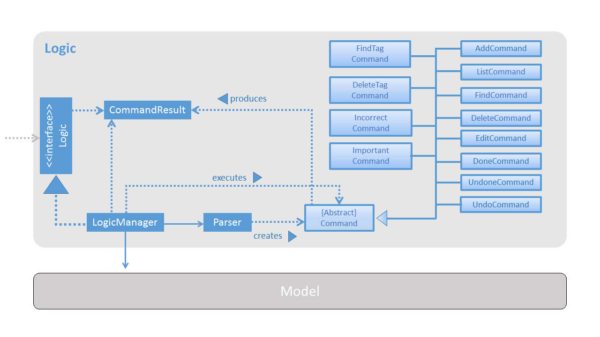
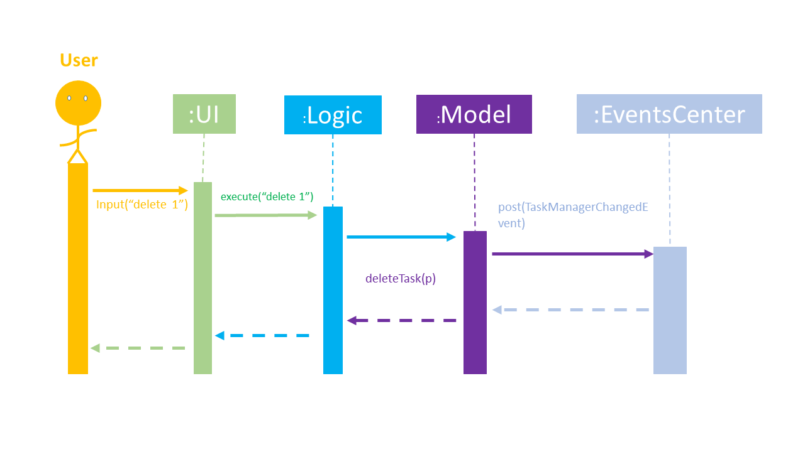
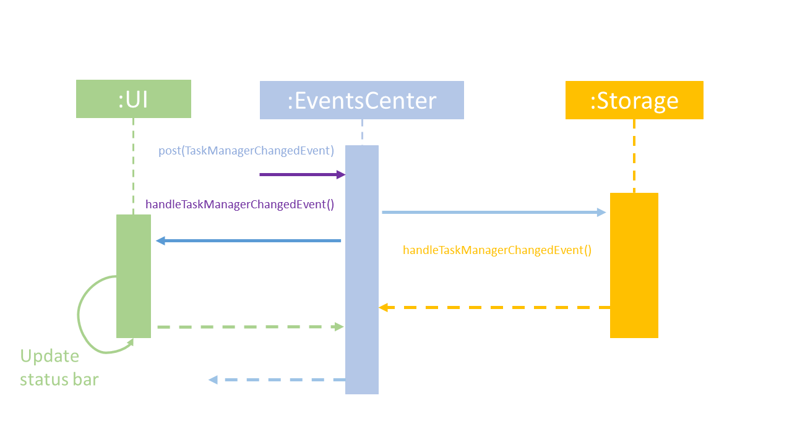
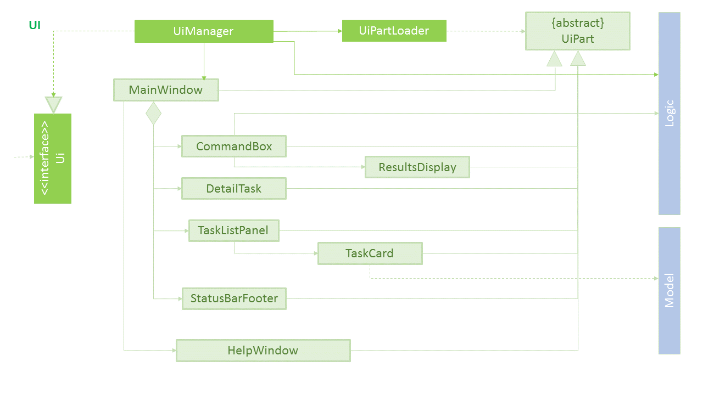
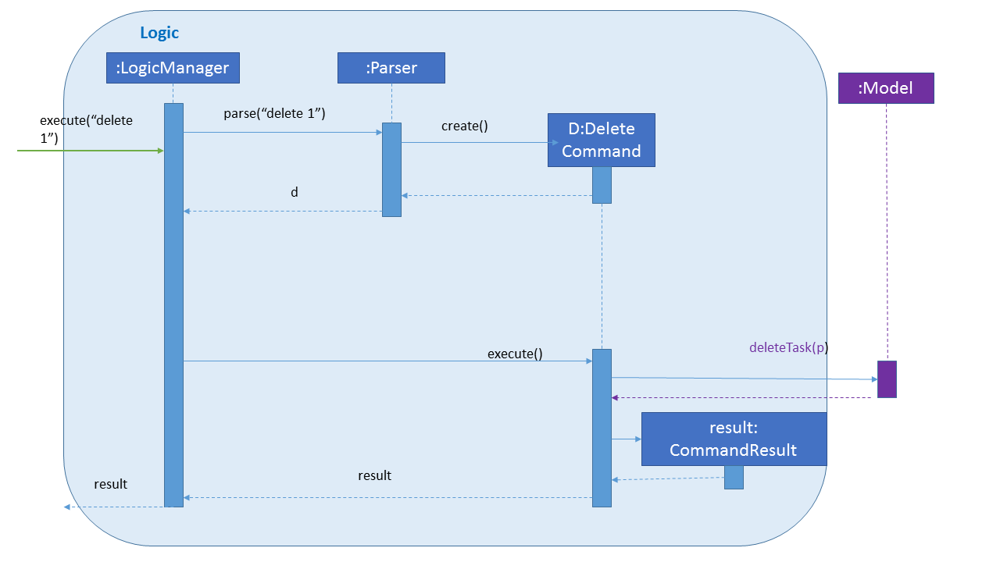

[//]: # (@@author A0139523E)
# Developer Guide

* [Introduction](#introduction)
* [Setting Up](#setting-up)
* [Design](#design)
* [Implementation](#implementation)
* [Testing](#testing)
* [Dev Ops](#dev-ops)
* [Appendix A: User Stories](#appendix-a--user-stories)
* [Appendix B: Use Cases](#appendix-b--use-cases)
* [Appendix C: Non Functional Requirements](#appendix-c--non-functional-requirements)
* [Appendix D: Glossary](#appendix-d--glossary)
* [Appendix E : Product Survey](#appendix-e--product-survey)

## Introduction
Hard2Do is a to-do list software designed for the users who have the need to manage his to-do list by simply typing on keyboard and enter command.

## Setting up

#### Prerequisites

1. **JDK `1.8.0_60`**  or later 

    > Having any Java 8 version is not enough.  
    This app will not work with earlier versions of Java 8.

2. **Eclipse** IDE
3. **e(fx)clipse** plugin for Eclipse (Do the steps 2 onwards given in
   [this page](http://www.eclipse.org/efxclipse/install.html#for-the-ambitious))
4. **Buildship Gradle Integration** plugin from the Eclipse Marketplace

#### Importing the project into Eclipse

0. Fork this repo, and clone the fork to your computer
1. Open Eclipse (Note: Ensure you have installed the **e(fx)clipse** and **buildship** plugins as given
   in the prerequisites above)
2. Click `File` > `Import`
3. Click `Gradle` > `Gradle Project` > `Next` > `Next`
4. Click `Browse`, then locate the project's directory
5. Click `Finish`

  > * If you are asked whether to 'keep' or 'overwrite' config files, choose to 'keep'.
  > * Depending on your connection speed and server load, it can even take up to 30 minutes for the set up to finish
      (This is because Gradle downloads library files from servers during the project set up process)
  > * If Eclipse auto-changed any settings files during the import process, you can discard those changes.

## Design

### Architecture

 
The **_Architecture Diagram_** given above explains the high-level design of the App.
Given below is a quick overview of each component.

`Main` has only one class called [`MainApp`](../src/main/java/seedu/address/MainApp.java). It is responsible for,
* At app launch: Initialing the components in the correct sequence, and connecting them up with each other.
* At shut down: Shutting down the components and invoking cleanup method where necessary.

[**`Commons`**](#common-classes) represents a collection of classes used by multiple other components.
Two of those classes play important roles at the architecture level.
* `EventsCentre` : This class (written using [Google's Event Bus library](https://github.com/google/guava/wiki/EventBusExplained))
  is used by components to communicate with other components using events (i.e. a form of Event Driven design)
* `LogsCenter` : This class is used by many classes to write log messages to the App's log file.

The rest of the App consists of four components.
* [**`UI`**](#ui-component) : Presents the UI of the App.
* [**`Logic`**](#logic-component) : Distribute the commands from the user.
* [**`Model`**](#model-component) : Holds the data of the App in-memory.
* [**`Storage`**](#storage-component) : Reads data from, and writes data to, the hard disk.

Each of the four components
* Defines its _API_ in an `interface` with the same name as the Component.
* Exposes its functionality using a `{Component Name}Manager` class.

For example, the `Logic` component (see the class diagram given below) defines it's API in the `Logic.java`
interface and exposes its functionality using the `LogicManager.java` class. 
 

The _Sequence Diagram_ below shows how the components interact for the scenario where the user issues the
command `delete 1`.

>Note how the `Model` simply raises a `TaskManagerChangedEvent` when the Task Manager data are changed,
 instead of asking the `Storage` to save the updates to the hard disk.

The diagram below shows how the `EventsCenter` reacts to that event, which eventually results in the updates
being saved to the hard disk and the status bar of the UI being updated to reflect the 'Last Updated' time.  

> Note how the event is propagated through the `EventsCenter` to the `Storage` and `UI` without `Model` having
  to be coupled to either of them. This is an example of how this Event Driven approach helps us reduce direct
  coupling between components.

The sections below give more details of each component.

### UI component

 

**API** : [`Ui.java`](../src/main/java/seedu/address/ui/Ui.java)

The UI consists of a `MainWindow` that is made up of parts e.g.`CommandBox`, `ResultDisplay`, `TaskListPanel`,
`StatusBarFooter`, `BrowserPanel` etc. All these, including the `MainWindow`, inherit from the abstract `UiPart` class
and they can be loaded using the `UiPartLoader`.

The `UI` component uses JavaFx UI framework. The layout of these UI parts are defined in matching `.fxml` files
 that are in the `src/main/resources/view` folder. 

 For example, the layout of the [`MainWindow`](../src/main/java/seedu/address/ui/MainWindow.java) is specified in
 [`MainWindow.fxml`](../src/main/resources/view/MainWindow.fxml)

The `UI` component,
* Executes user commands using the `Logic` component.
* Binds itself to some data in the `Model` so that the UI can auto-update when data in the `Model` change.
* Responds to events raised from various parts of the App and updates the UI accordingly.

### Logic component

 

**API** : [`Logic.java`](../src/main/java/seedu/address/logic/Logic.java)

1. `Logic` uses the `Parser` class to parse the user command, this results in a `Command` object which is executed by the `LogicManager`.
3. The command execution can affect the `Model` (e.g. adding a task) and/or raise events. The result of the command execution is encapsulated as a `CommandResult` object which is passed back to the `Ui`.

Given below is the Sequence Diagram for interactions within the `Logic` component for the `execute("delete 1")`
 API call. 
 

### Model component

 

**API** : [`Model.java`](../src/main/java/seedu/address/model/Model.java)

The `Model`,
* Stores a `UserPref` object that represents the user's preferences.
* Stores the Task Manager data.
* Exposes a `UnmodifiableObservableList<ReadOnlyTask>` that can be 'observed' e.g. the UI can be bound to this list
  so that the UI automatically updates when the data in the list change.
* Does not depend on any of the other three components.

[//]: # (@@author A0147989B)
### Storage component

 

**API** : [`Storage.java`](../src/main/java/seedu/address/storage/Storage.java)

The `Storage` component,
* Saves `UserPref` objects in json format and read it back.
* Saves the task manager data in xml format and read it back.

### Common classes

Classes used by multiple components are in the `*.commons` package.

## Implementation

### Logging

We are using `java.util.logging` package for logging. The `LogsCenter` class is used to manage the logging levels
and logging destinations.

* The logging level can be controlled using the `logLevel` setting in the configuration file
  (See [Configuration](#configuration))
* The `Logger` for a class can be obtained using `LogsCenter.getLogger(Class)` which will log messages according to
  the specified logging level
* Currently log messages are output through: `Console` and to a `.log` file.

**Logging Levels**

* `SEVERE` : Detected critical problem which may possibly cause the termination of the application
* `WARNING` : Detected problem, the program will continue, but with caution
* `INFO` : Show the information of the noteworthy actions by the App
* `FINE` : Show the information of the actions by the app which may be useful in debugging
  e.g. print the actual list instead of just its size

### Configuration

Certain properties of the application can be controlled (e.g App name, logging level) through the configuration file
(default: `config.json`):

## Testing

Tests can be found in the `./src/test/java` folder.

**Tests using Eclipse**:
> If you are not using a recent Eclipse version (i.e. _Neon_ or later), enable assertions in JUnit tests
  as described [here](http://stackoverflow.com/questions/2522897/eclipse-junit-ea-vm-option).

* To run all tests, right-click on the `src/test/java` folder and choose
  `Run as` > `JUnit Test`
* To run a subset of tests, right-click on a test package, test class, or a test and choose
  to run as a JUnit test.

**Tests using Gradle**:

See [UsingGradle.md](UsingGradle.md) for how to run tests using Gradle.

We have two types of tests:

1. **GUI Tests** - These are _System Tests_ that test the entire App by simulating user actions on the GUI.
   These are in the `guitests` package.

2. **Non-GUI Tests** - These are tests not involving the GUI. They include,
   1. _Unit tests_ targeting the lowest level methods/classes.  
      e.g. `hard2do.taskmanager.commons.UrlUtilTest`
   2. _Integration tests_ that are checking the integration of multiple code units
     (those code units are assumed to be working). 
      e.g. `hard2do.taskmanager.storage.StorageManagerTest`
   3. Hybrids of unit and integration tests. These tests are checking multiple code units as well as
      how they are connected together. 
      e.g. `hard2do.taskmanager.logic.LogicManagerTest`

**Headless GUI Testing** :
Thanks to the [TestFX](https://github.com/TestFX/TestFX) library we use,
 our GUI tests can be run in the headless mode.
 In the headless mode, GUI tests do not show up on the screen.
 That means the developer can do other things on the Computer while the tests are running. 
 See [UsingGradle.md](UsingGradle.md#running-tests) to learn how to run tests in headless mode.

## Dev Ops

### Build Automation

See [UsingGradle.md](UsingGradle.md) to learn how to use Gradle for build automation.

### Continuous Integration

We use [Travis CI](https://travis-ci.org/) to perform _Continuous Integration_ on our projects.
See [UsingTravis.md](UsingTravis.md) for more details.

### Making a Release

Here are the steps to create a new release.

 1. Generate a JAR file [using Gradle](UsingGradle.md#creating-the-jar-file).
 2. Tag the repo with the version number. e.g. `v0.1`
 2. [Create a new release using GitHub](https://help.github.com/articles/creating-releases/)
    and upload the JAR file you created.

### Managing Dependencies

A project often depends on third-party libraries. For example, Task Manager depends on the
[Jackson library](http://wiki.fasterxml.com/JacksonHome) for XML parsing. Managing these _dependencies_
can be automated using Gradle. For example, Gradle can download the dependencies automatically, which
is better than these alternatives. 
a. Include those libraries in the repo (this bloats the repo size) 
b. Require developers to download those libraries manually (this creates extra work for developers) 

## Appendix A : User Stories

Priorities: High (must have) - `* * *`, Medium (nice to have)  - `* *`,  Low (unlikely to have) - `*`

Priority | As a ... | I want to ... | So that I can...
-------- | :-------- | :--------- | :-----------
`* * *` | user | add a new to-do item | keep track of tasks to be done
`* * *` | user | clear all appointments | start afresh easily
`* * *` | new user | see usage instructions | refer to instructions when I forget how to use the App
`* * *` | user | delete a to-do | remove entries that I no longer need
`* * *` | user | edit a to-do | change my schedule
`* * *` | user | find a to-do by word | locate details of to-dos without having to go through the entire list
`* * *` | user | find a to-do by its tag | locate details of my to-dos based on tags assigned
`* * *` | user | add a tag to a to-do | label my to-dos by the same tag so it is easily found
`* * *` | user | delete a tag from a to-do | change tags assigned to the to-dos
`* * *` | user | mark to-do as done | keep track of completed tasks
`* * *` | user | undo actions taken | fix mistakes in my schedule
`* * *` | user | list all my to-dos | view all to-dos that have been added
`* * *` | user | list all the to-dos that are marked as done | refer to what to-dos have been done`
`* * *` | user | list all the to-dos that are marked as undone | refer to what to-dos have not been done
`* * *` | user | list all the to-dos that are marked as important | refer to what to-dos should be done first
`* * *` | user | change the priority of my to-do | focus on the to-dos which have been labelled more important
`* * *` | user | be able to load my task manager from a saved state | go back to a previous state if needed
`* * *` | user | be able to save a copy of my task manager | go back to a previous state if needed
`* * *` | user | select to-dos in the list with just commands | view its details without using a mouse
`* * *` | user | exit the app with just commands | close the app without using a mouse
`* * *` | new user | see usage instructions | refer to instructions when I forget how to use the App
`* *` | user | be reminded of the appointment | stop worry about deadlines
`* *` | user | save email as to-do | save time re-writing and scheduling task
`* *` | user | use it offline | use it anywhere
`*` | user | share my to-do-list with others | discover if there are clashes
`*` | user | list events within a time frame | be aware of upcoming events
`*` | user with many to-dos in the task manager | sort to-dos by importance | decide which item to do first

## Appendix B : Use Cases

(For all use cases below, the **System** is the `TaskManager` and the **Actor** is the `user`, unless specified otherwise)

#### Use case: Add task

**MSS**

1. User requests to add tasks
2. TaskManger adds tasks to its data
Use case ends.

**Extensions**

2a. An invalid command is entered
> 2a1. User is shown the correct format with an example
  Use case resumes at step 1

2b. Adding a duplicate task
> 2b1. User is notified that task already exists
  Use case resumes at step 1

#### Use case: Delete task

**MSS**

1. User requests to list tasks
2. TaskManager shows a list of tasks
3. User requests to delete a specific task in the list
4. TaskManager deletes the task  
Use case ends.

**Extensions**

2a. The list is empty

> Use case ends

3a. The given index is invalid

> 3a1. TaskManager shows an error message  
  Use case resumes at step 2

#### Use case : Find tasks

**MSS**

1. User requests to find tasks with specific keywords
2. TaskManager returns a list of tasks with all matching keywords
Use case ends

**Extensions**

1a. No keywords were inputted
> TaskManager shows an error message  
  Use case resumes at step 1

#### Use case : List all tasks

**MSS**

1. User requests to list all tasks
2. TaskManager shows all tasks added
Use case ends

**Extensions**

2a. The list is empty

> Use case ends

#### Use case : Mark As Done

**MSS**

1. User requests to list all undone tasks
2. TaskManager shows a list of all undone tasks
3. User requests to mark specific task as done
4. TaskManager marks the task as done  
Use case ends.

**Extensions**

2a. The list is empty

> Use case ends

3a. The given index is invalid

> 3a1. TaskManager shows an error message  
  Use case resumes at step 2

4a. The task has already been marked as done  

> Use case ends

## Appendix C : Non Functional Requirements

1. Should work on any [mainstream OS](#mainstream-os) as long as it has Java `1.8.0_60` or higher installed.
2. Should be able to hold up to 1000 tasks.
3. Should come with automated unit tests and open source code.
4. Should favor DOS style commands over Unix-style commands.

## Appendix D : Glossary

##### Mainstream OS

> Windows, Linux, Unix, OS-X

##### Private contact detail

> A contact detail that is not meant to be shared with others

[//]: # (@@author A0141054W)

## Appendix E : Product Survey

#### Wunderlist
* Pros:
~~~~
User Interface(UI) is responsive and effective
Mail-to list function is very convenient
~~~~
* Cons:
~~~~
Wunderlist cannot sync with google calendar
WunderList cannot show calendar style
~~~~

#### Todoist
* Pros:
~~~~
UI is responsive and effective
Todoist can automatically identify the time for to-do
Todoist can instantly recognise short-hand like "tmr" "tues"
Todoist have Mail-to list function
~~~~
* Cons:
~~~~
Todoist cannot sync with google calendar
Todoist cannot see calendar style
~~~~

#### Google Calendar
* Pros:
~~~~
UI is the most responsive and effective
Google Calendar have Mail-to list function
Google Calendar can also sync well with other calendars
~~~~
* Cons:
~~~~
Google Calendar requires too much work needed to add an item
~~~~
