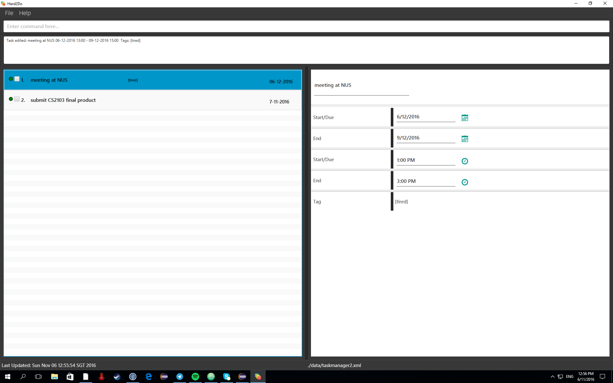

# User Guide
## 1 Table Of Contents
 [2 About Hard2Do](#2-about-hard2do) 
 [3 Getting Started](#3-getting-started) 
 &nbsp;&nbsp;&nbsp;&nbsp;&nbsp;&nbsp;
 [3.1 Prerequisites](#31-prerequisites)  
 &nbsp;&nbsp;&nbsp;&nbsp;&nbsp;&nbsp;
 [3.2 Launch](#32-launch)  
 &nbsp;&nbsp;&nbsp;&nbsp;&nbsp;&nbsp;
 [3.3 Commands](#33-commands)  
 [4 Features](#4-features-) 
 &nbsp;&nbsp;&nbsp;&nbsp;&nbsp;&nbsp;
 [4.1 Adding tasks](#41-adding-tasks--add)  
 &nbsp;&nbsp;&nbsp;&nbsp;&nbsp;&nbsp;&nbsp;&nbsp;&nbsp;&nbsp;&nbsp;&nbsp;
 [4.1.1 Add a floating task to Hard2Do](#41-adding-tasks--add)  
 &nbsp;&nbsp;&nbsp;&nbsp;&nbsp;&nbsp;&nbsp;&nbsp;&nbsp;&nbsp;&nbsp;&nbsp;
 [4.1.2 Add a task with date and time to Hard2Do](#41-adding-tasks--add)  
 &nbsp;&nbsp;&nbsp;&nbsp;&nbsp;&nbsp;&nbsp;&nbsp;&nbsp;&nbsp;&nbsp;&nbsp;
 [4.1.3 Add a task with date to Hard2Do using shortcuts](#41-adding-tasks--add)  
 &nbsp;&nbsp;&nbsp;&nbsp;&nbsp;&nbsp;&nbsp;&nbsp;&nbsp;&nbsp;&nbsp;&nbsp;
 [4.1.4 Add a task with time to Hard2Do using shortcuts](#41-adding-tasks--add)  
 &nbsp;&nbsp;&nbsp;&nbsp;&nbsp;&nbsp;&nbsp;&nbsp;&nbsp;&nbsp;&nbsp;&nbsp;
 [4.1.5 Add a recurring task](#41-adding-tasks--add)  
 &nbsp;&nbsp;&nbsp;&nbsp;&nbsp;&nbsp;
 [4.2 Adding tags](#42-adding-tags--addtag)  
 &nbsp;&nbsp;&nbsp;&nbsp;&nbsp;&nbsp;
 [4.3 Listing tasks](#43-listing-tasks--list)  
 &nbsp;&nbsp;&nbsp;&nbsp;&nbsp;&nbsp;&nbsp;&nbsp;&nbsp;&nbsp;&nbsp;&nbsp;
 [4.3.1 List all undone tasks](#43-listing-tasks--list)   
 &nbsp;&nbsp;&nbsp;&nbsp;&nbsp;&nbsp;&nbsp;&nbsp;&nbsp;&nbsp;&nbsp;&nbsp;
 [4.3.2 List all tasks added](#43-listing-tasks--list)  
 &nbsp;&nbsp;&nbsp;&nbsp;&nbsp;&nbsp;&nbsp;&nbsp;&nbsp;&nbsp;&nbsp;&nbsp;
 [4.3.3 List all tasks that are marked as done](#43-listing-tasks--list)   
 &nbsp;&nbsp;&nbsp;&nbsp;&nbsp;&nbsp;&nbsp;&nbsp;&nbsp;&nbsp;&nbsp;&nbsp;
 [4.3.4 List all tasks that are marked as important](#43-listing-tasks--list)  
 &nbsp;&nbsp;&nbsp;&nbsp;&nbsp;&nbsp;&nbsp;&nbsp;&nbsp;&nbsp;&nbsp;&nbsp;
 [4.3.5 List all tasks that are marked as unimportant](#43-listing-tasks--list)   
 &nbsp;&nbsp;&nbsp;&nbsp;&nbsp;&nbsp;
 [4.4 Finding a task](#44-finding-a-task--find)  
 &nbsp;&nbsp;&nbsp;&nbsp;&nbsp;&nbsp;
 [4.5 Finding a tag](#45-finding-a-tag--findtag)  
 &nbsp;&nbsp;&nbsp;&nbsp;&nbsp;&nbsp;
 [4.6 Deleting a task](#46-deleting-a-task--delete)  
 &nbsp;&nbsp;&nbsp;&nbsp;&nbsp;&nbsp;
 [4.7 Deleting tags from task](#47-deleting-tags-from-task--deltag) 
 &nbsp;&nbsp;&nbsp;&nbsp;&nbsp;&nbsp;
 [4.8 Undoing an action](#48-undoing-an-action--undo)  
 &nbsp;&nbsp;&nbsp;&nbsp;&nbsp;&nbsp;
 [4.9 Selecting a task](#49-selecting-a-task--select)  
 &nbsp;&nbsp;&nbsp;&nbsp;&nbsp;&nbsp;
 [4.10 Editing a task](#410-editing-a-task--edit)  
 &nbsp;&nbsp;&nbsp;&nbsp;&nbsp;&nbsp;
 [4.11 Marking task as important](#411-marking-task-as-important--important)  
 &nbsp;&nbsp;&nbsp;&nbsp;&nbsp;&nbsp;
 [4.12 Marking task as unimportant](#412-marking-task-as-unimportant--unimportant)  
 &nbsp;&nbsp;&nbsp;&nbsp;&nbsp;&nbsp;
 [4.13 Marking task as done](#413-marking-task-as-done--done)  
 &nbsp;&nbsp;&nbsp;&nbsp;&nbsp;&nbsp;
 [4.14 Marking task as undone](#414-marking-task-as-undone--notdone)  
 &nbsp;&nbsp;&nbsp;&nbsp;&nbsp;&nbsp;
 [4.15 Clearing all entries](#415-clearing-all-entries--clear)  
 &nbsp;&nbsp;&nbsp;&nbsp;&nbsp;&nbsp;
 [4.16 Saving tasks](#416-saving-tasks--save)  
 &nbsp;&nbsp;&nbsp;&nbsp;&nbsp;&nbsp;
 [4.17 Loading tasks](#417-loading-tasks--load)  
 &nbsp;&nbsp;&nbsp;&nbsp;&nbsp;&nbsp;
 [4.18 Getting the next date of a recurring task](#418-getting-the-next-date-of-a-recurring-task--next)  
 &nbsp;&nbsp;&nbsp;&nbsp;&nbsp;&nbsp;
 [4.19 Emailing tasks](#419-emailing-tasks--email)  
 &nbsp;&nbsp;&nbsp;&nbsp;&nbsp;&nbsp;
 [4.20 Exiting the program](#420-exiting-the-program--exit)  
 &nbsp;&nbsp;&nbsp;&nbsp;&nbsp;&nbsp;
 [4.21 Viewing help](#421-viewing-help--help)  
 [5 FAQ](#5-faq)  
 [6 Command Summary](#6-command-summary) 

## 2 About Hard2Do

  >Are you tired of having too many tasks on your mind and constantly being frustrated of not having an avenue to list them down? Fret not because Hard2Do is here to save you from all your daily migraines that will soon be a thing of the past.

  >Hard2Do is a personal scheduler that enables you to manage your daily tasks in an easy and flexible manner. It will keep your added tasks in order and remind you when the deadline is approaching. Unlike other task managers that you have encountered before, instead of being inconvenienced by the use of a mouse, all it takes is just a single line of command to get things done. No longer will you have to be burdened by the use of a mouse as everything can be done just on the keyboard itself! Furthermore, this is just the beginning of the multitude of functions that Hard2Do is able to perform.

  >Read on to find out more!

## 3 Getting Started

### 3.1 Prerequisites
1. *Java Version 1.8.0_60*  
   Before you can get started, ensure you have Java version `1.8.0_60` or later installed in your Computer.  
   > Having any Java 8 version is not enough.  
   This app will not work with earlier versions of Java 8.

2. *Hard2Name.exe*  
 Download the latest `Hard2Name.jar` from the [releases](../../../releases) tab.

### 3.2 Launch
Now you can finally begin your journey with `Hard2Do` Task Manager.  
1. Copy the file to the folder you want to use as the home folder for your `Hard2Do` list. 

2. Double-click the file to start the app. The GUI should appear in a few seconds.  

   > 

### 3.3 Commands
4. Type the command in the command box and press <kbd>Enter</kbd> to execute it.  
   e.g. typing **`help`** and pressing <kbd>Enter</kbd> will open the help window.
5. Some example commands you can try:
   * **`list`** : lists all tasks to do in the future
   * **`add`**` go to tutorial sd/10-12-2016 st/12:00 #sadlife ` :
     adds a task of `Go to tutorial` to the `Hard2Do` Task Manager.
   * **`delete`**` 3` : deletes the 3rd task shown in the current list
   * **`exit`** : exits the app
   * **`edit`**` 3 c/do homework ` :
      updates the contents in the 3rd task shown in the current list
6. Refer to the [Features](#features) section below for details of each command. 

## 4 Features  
In the guide below, we will showcase how to execute the various features that `Hard2Do` has.
> **Command Format**
> * Words in `UPPER_CASE` are the parameters.
> * Items in `SQUARE_BRACKETS` are optional.
> * Items with `...` after them can have multiple instances.
> * Not all orders of parameters are fixed.

### 4.1 Adding tasks : `add`
*4.1.1 Add a floating task to `Hard2Do`*  
Adds a task without any date or time  
Format: `add TASKDETAILS`  

Examples:
* `add Have a bbq`  
Adds a task "Have a bbq" with no date or time
* `add Do CS2103 tutorial`  
Adds a task "Do CS2103 tutorial" with no date or time

*4.1.2 Add a task with date and time to `Hard2Do`*  
Adds a task with date and time  
Format: `add TASKDETAILS sd/DD-MM-YYYY ed/DD-MM-YYYY st/HH:MM et/HH:MM #TAGNAME...`  
> * The `presence and order` of arguments after `TASKDETAILS` do not matter except end time and dates `cannot be added` without a start time or date.
> * The format of time is `24 hours`. e.g. `19:15`
> * The days and months of dates added can be a single number. e.g. `sd/22-6-2016` or `ed/2-6-2016`
> * `sd/` takes in the start date, `ed/` takes in the end date, `st/` takes in the start time and `et/` takes in the end time.
> * `#` takes in the tags assigned to that task and multiple tags can be added.
> * Time inputted cannot be represented by a single digit. e.g. ~~`9:30`~~

Examples:
* `add Go to CS tutorial sd/10-6-2016 st/12:00 #takethelaptop`  
Adds a task "Go to CS tutorial" with a start date of "10-6-2016" and start time of "12:00" with the tag "takethelaptop"
* `add Eat dinner sd/7-10-2016 st/19:00 et/20:00 #hungry #nomoney`  
Adds a task "Eat dinner" with a start date "7-10-2016", start time of "19:00" and end time of "20:00" with the tags "hungry" and "nomoney"
* `add Go for night cycling sd/1-7-2016 ed/2-7-2016 st/22:00 et/04:00 #tiring`  
Adds a task "Go for night cycling" with a start date "1-7-2016", end date "2-7-2016", start time "22:00" and end time of "04:00" with the tag "tiring"
* `add Watch movie st/20:01 #gotmoney`  
Adds a task "Watch movie" with start time "20:01" with the tag "gotmoney"
* `add Do homework sd/28-10-2016`  
Adds a task "Do homework" with a start date "28-10-2016"

*4.1.3 Add a task with date to `Hard2Do` using shortcuts*  
Adds a task with date using specific keywords  
Format: `add TASKDETAILS KEYWORDS`
> * This command can be used in combination with `4.1.2` where the start date is replaced with the `KEYWORDS`.
> * The available `KEYWORDS` are `tmr, tomorrow, next week, next wed, this wed`.
> * `next week` adds to the task a date which is 7 days later.
> * The keyword following `this` and `next` can be of any day of the week e.g. `this thurs, next mon`.
> * The format of the day keyword can be in `short form` e.g. `wed, thurs`.
> * `this DAYOFTHEWEEK` refers to the nearest instance of that day while `next DAYOFTHEWEEK` refers to the 2nd nearest instance of that day.

Examples:
* `add meeting tmr #shag`  
  Adds a task "meeting" for tomorrow's date
* `add dinner this wed`  
Adds a task "dinner" for the nearest wednesday
* `add study for exam next week`  
Adds a task "study for exam" for 7 days later from the current date
* `add wash clothes next fri`  
Adds a task "wash clothes" for the next friday after the nearest one

*4.1.4 Add a task with time to `Hard2Do` using shortcuts*  
Adds a task with time using specific keywords  
Format: `add TASKDETAILS at STARTTIME` or `add TASKDETAILS from STARTTIME to ENDTIME`
> * This command can be used with `4.1.3` and `4.1.2` where the start time and end time are replaced with `STARTTIME` and `ENDTIME` respectively.
> * `STARTIME` and `ENDTIME` has the format of `am` and `pm`. e.g. `at 3pm` or `from 2pm to 3pm`

Examples:
* `add submit report tmr at 5pm #shag`  
Adds a task "submit report" for tomorrow's date with a start time of 5pm
* `add dance lesson next wed from 5pm to 6pm #fun`  
Adds a task "dance lesson" for the next wednesday after the nearest one with a start time of 5pm and end time of 6pm with the tag "fun"

*4.1.5 Add a recurring task*  
Adds a task that is repeated frequently over specified period of time  
Format: `add TASKDETAILS r/DURATION`
> * This command can be used with `all` commands above.
> * `Duration` refers to the number of days before the task is repeated and must be an `integer`.
> * Only tasks added with `r/` are able to use the `next` command.

Examples:
* `add EE2020 lab sd/13-2-2016 r/7`  
Adds a task "EE2020 lab" with a start date of "13-2-2016" which occurs again in 7 days, on "20-2-2016"
* `add dinner sd/14-3-2016 st/19:00 r/1`  
Adds a task "dinner" with a start date of "14-3-2016", start time of "19:00" which occurs again in 1 day, on "15-3-2016"

### 4.2 Adding tags : `addtag`
Adds tags to the specified task  
Format: `addtag INDEX TAGNAME...`
> * `INDEX` refers to the index number shown in the current listing. 
> * The index **must be a positive integer** 1, 2, 3, ...
> * Multiple tags can be added.

Examples:
* `list`  
`addtag 1 CS2103`  
Adds tag "CS2103" to the 1st task in the list
* `list`  
`addtag 2 shag tough tired`  
Adds tags "shag", "tough" and "tired" to the 2nd task in the list

### 4.3 Listing tasks : `list`
*4.3.1 List all undone tasks*  
Shows a list of all undone tasks added 
Format: `list`

*4.3.2 List `all` tasks added*  
Shows the entire list of tasks that are added  
Format: `list all` or `list -a`
> * This command shows all added task, regardless of priority or status.

*4.3.3 List all tasks that are marked as `done`*  
Shows a list of all tasks that are marked as done  
Format: `list done` or `list -d`

*4.3.4 List all tasks that are marked as `important`*  
Shows a list of all tasks that are marked as important  
Format: `list important` or `list -i`

*4.3.5 List all tasks that are marked as `unimportant`*  
Shows a list of all tasks that are marked as unimportant  
Format: `list unimportant` or `list -ui`

### 4.4 Finding a task : `find`
Finds tasks whose names contain any of the given keywords 
Format: `find KEYWORD [MORE_KEYWORDS]`

> * The search is case insensitive. e.g `cs` will match `CS`
> * The order of the keywords does not matter. e.g. `CS tut` will match `tut CS`
> * Only the content of the task is searched.
> * Partial words will also be matched. e.g. `CS` will match `CSS`
> * Tasks matching `at least one keyword` will be returned.
    e.g. `CS` will match `CS tutorial`

Examples:
* `find tutorial` 
  Returns `Go to CS TUTORIAL`
* `find CS EE CEG` 
  Returns ANY tasks having content `CS`, `EE`, or `CEG`
* `find lab`  
  Returns `label cup` and `go to lab`

### 4.5 Finding a tag : `findtag`
Finds all tasks with the specified tag given  
Format: `findtag TAGNAME`
> * This command is only able to find `one` tag.
> * The search is `case insensitive`.
> * Only full words will be matched. e.g. `CS21` will not match `CS2103`

Examples:
* `findtag CS2103`  
Returns ANY tasks which have the tag "CSS2103"
* `findtag homework`  
Returns ANY tasks which have the tag "homework"

### 4.6 Deleting a task : `delete`
Deletes the specified task from `Hard2Do`  
Format: `delete INDEX`

> * Deletes the task at the specified `INDEX`.  
> * The index refers to the index number shown in the current listing.  
> * The index **must be a positive integer** 1, 2, 3, ...
> * Task deleted can be restored by using the `undo` command as long as it is within the same usage but is irreversible once `Hard2Do` is closed.

Examples:
* `list` 
  `delete 2` 
  Deletes the 2nd task in `Hard2Do`
* `find tutorial` 
  `delete 1` 
  Deletes the 1st task in the results of the `find` command

### 4.7 Deleting tags from task : `deltag`
Deletes tags from the specific task  
Format: `deltag INDEX TAGNAMES...`
> * The `INDEX` refers to the index number shown in the current listing.  
> * The index **must be a positive integer** 1, 2, 3, ...
> * This command is `case insensitive`.
> * Multiple tags can be deleted.

Examples:
* `list`  
  `deltag 1 cs2103`  
  Deletes tag "CS2103" from the 1st task
* `list`  
  `deltag 3 everything something nothing`  
  Deletes tags "everything", "something" and "nothing" from the 3rd task

### 4.8 Undoing an action : `undo`
Undo the previous action  
Format: `undo`
> * Only commands that change the state of `Hard2Do` can be undone.

### 4.9 Selecting a task : `select`
Selects the task identified by the index number used in the last task listing 
Format: `select INDEX`

> * Selects the task and loads the details of the task at the specified `INDEX`.  
> * The `INDEX` refers to the index number shown in the current listing.  
> * The index **must be a positive integer** 1, 2, 3, ...

Examples:
* `list` 
  `select 2` 
  Selects and shows the details of the 2nd task in the to-do list
* `find CS`  
  `select 1` 
  Selects and shows the details of the 1st task in the results of the `find` command

### 4.10 Editing a task : `edit`
Edits the task identified by the index number used in the last task listing 
Format: `edit INDEX c/TASKDETAILS sd/DD-MM-YYYY ed/DD-MM-YYYY st/HH:MM et/HH:MM`

> * Edits the current selected task and updates the edited details.  
> * Tags can not be edited using this command.  
> * The `presence and order` of arguments after `TASKDETAILS` do not matter.  
> * The `INDEX` refers to the index number shown in the current listing.  
> * The index **must be a positive integer** 1, 2, 3, ...
> * Repetition of detail type is not allowed.

Examples:
* `list` 
  `edit 2 st/18:00` 
  Updates the start time of the 2nd task to 18:00
* `list`  
  `edit 3 sd/7-10-2016 st/1800 c/update details`  
  Updates the start date, start time and task detail of the 3rd task

### 4.11 Marking task as important : `important`
Sets the specified task of the current task listing to important priority  
Format: `important INDEX`
> * Indicator next to the task name turns from `green` to `red`.
> * The `INDEX` refers to the index number shown in the current listing.  
> * The index **must be a positive integer** 1, 2, 3, ...

Examples:
* `important 2`  
Changes the priority of the 2nd task to important
* `list`  
`important 3`  
Changes the priority of the 3rd task in the current task listing to important

### 4.12 Marking task as unimportant : `unimportant`
Sets the specified task of the current task listing to unimportant priority  
Format: `unimportant INDEX`
> * Indicator next to the task name turns from `red` to `green`.
> * The `INDEX` refers to the index number shown in the current listing.  
> * The index **must be a positive integer** 1, 2, 3, ...

Examples:
* `unimportant 1`  
Changes the priority of the 1st task to unimportant
* `list`  
`unimportant 3`  
Changes the priority of the 3rd task in the current task listing to unimportant

### 4.13 Marking task as done : `done`
Changes the state of a task to done when it is completed  
Format: `done INDEX`
> * The checkbox next to the task name becomes ticked.
> * The `INDEX` refers to the index number shown in the current listing.  
> * The index **must be a positive integer** 1, 2, 3, ...

Examples:
* `done 1`  
Marks the 1st task as done
* `list`  
`done 3`  
Marks the 3rd task in the current task listing as done

### 4.14 Marking task as undone : `notdone`
Changes the state of a task to undone  
Format: `notdone INDEX`
> * The checkbox next to the task name becomes unticked.
> * The `INDEX` refers to the index number shown in the current listing.  
> * The index **must be a positive integer** 1, 2, 3, ...

Examples:
* `notdone 1`  
Marks the 1st task as undone
* `list`  
`notdone 2` 
Marks the 2nd task in the current task listing as undone

### 4.15 Clearing all entries : `clear`
Clears all entries in `Hard2Do`  
Format: `clear`  
> * This command can still be undone if `Hard2Do` has not been closed.

### 4.16 Saving tasks : `save`
Saves a new copy of the current data in `Hard2Do`  
Format: `save FILELOCATION`
> *  Any commands that `changes` the data after `save` will be automatically saved to the current file you are using.
> * The file name of which file you are using is located at the `bottom` of `Hard2Do`.
> * `FILELOCATION` includes the `filename` e.g. `data/taskmanager.xml`.
> * If the `filename` specified already exists, the current data `overwrites` the old data in that file, else a new file is created with that file name in the specified directory.

Examples:
* `save data/taskmanager.xml`  
Overwrites taskmanager.xml since taskmanager.xml already exists
* `save data/taskmanager2.xml`  
New saved file named "taskmanager2.xml" is created

### 4.17 Loading tasks : `load`
Loads a previous saved state of `Hard2Do`  
Format: `load FILELOCATION`
> * `Hard2Do` has to be restarted after the command is used.
> * `FILELOCATION` includes the `filename`. e.g. `data/taskmanager.xml`

Examples:
* `load data/taskmanager.xml`  
Loads the previously saved file taskmanager.xml
* `load data/taskmanager2.xml` 
Loads the previously saved file taskmanager2.xml

### 4.18 Getting the next date of a recurring task : `next`
Sets the date of the specified recurring task in the current task listing to the next date that it will occur on  
Format: `next INDEX`
> * The `INDEX` refers to the index number shown in the current listing.  
> * This command only works on tasks which were added as `recurring`.
> * The index **must be a positive integer** 1, 2, 3, ...

Examples:
* `next 2`  
Sets the date of the 2nd task to the date of its next occurrence
* `list`  
`next 3`  
Sets the date of the 3rd task in the current task listing to the date of its next occurrence

### 4.19 Emailing tasks : `email`
*4.19.1 Add all unread email*  
Adds all unread email inside your mailbox to `Hard2Do` 
Format: `email`
> * When used for the first time, this command will redirect you to a webpage for permission.
> * Grant the permission to `Hard2Do`.

*4.19.2 Add all unread email from a specific address*  
Adds all unread email inside your mailbox from a specific address to `Hard2Do`  
Format: `email EMAILNAME`

Examples:
* `email vitquay1996@gmail.com` 
Adds all unread email from "vitquay1996@gmail.com" into `Hard2Do`
* `email myemail@gmail.com`  
Adds all unread email from "myemail@gmail.com" into `Hard2Do`

### 4.20 Exiting the program : `exit`
Exits and closes `Hard2Do` 
Format: `exit`  

### 4.21 Viewing help : `help`
Opens up the link to our user guide where the format of commands can be referred from  
Format: `help`

> * The proper format of commands will also be shown if you enter an incorrect command e.g. `abcd`

## 5 FAQ

**Q**: How do I transfer my data to another computer? 
**A**: Install the app in the other computer and overwrite the empty data file it creates with
       the file that contains the data of your previous Hard2Do list folder.

## 6 Command Summary

Command | Format  
-------- | :--------
Add | `add TASKDETAILS [sd/DD-MM-YYYY] [ed/DD-MM-YYYY] [st/HH:MM] [et/HH:MM] [r/DURATION] [#TAGNAME...]`
Add Shortcuts | `add TASKDETAILS KEYWORDS` or `add TASKDETAILS at STARTTIME` or `add TASKDETAILS from STARTTIME to ENDTIME`
AddTag | `addtag INDEX TAGNAME...`
List | `list`
List All | `list all` or `list -a`
List Done | `list done` or `list -d`
List Important | `list important` or `list -i`
List Unimportant | `list unimportant` or `list -ui`
Find | `find KEYWORD [MORE_KEYWORDS]`
Find Tag | `findtag TAGNAME`
Delete | `delete INDEX`
Delete Tags | `deltag INDEX TAGNAME...`
Undo | `undo`
Select | `select INDEX`
Edit | `edit INDEX c/TASKDETAILS sd/DD-MM-YYYY ed/DD-MM-YYYY st/HH:MM et/HH:MM`
Important | `important INDEX`
Unimportant | `unimportant INDEX`
Done | `done INDEX`
Undone | `notdone INDEX`
Clear | `clear`
Save | `save FILELOCATION`
Load | `load FILELOCATION`
Next Date | `next INDEX`
Email | `email` or `email EMAILNAME`
Exit | `exit`
Help | `help`
